<div align="center">

# 👥 Employee Management System

### Secure workforce management, reporting hierarchy, and analytics in one place

[](https://react.dev/)
[](https://www.typescriptlang.org/)
[](https://expressjs.com/)
[](https://www.postgresql.org/)
[](#testing)

**A production-oriented full-stack application built to manage employees, access roles, departments, reporting relationships, and workforce insights.**

[Live Demo](https://employee-management-system-frontend-f4dp.onrender.com/) · [Features](#-key-features) · [Tech Stack](#-technology-stack) · [RBAC](#-role-based-access-control) · [Setup](#-run-locally) · [API Docs](docs/api.md) · [Contact](#-author)

</div>

---

## 🌐 Live deployment

| Service | URL |
| --- | --- |
| Frontend application | [Open live application](https://employee-management-system-frontend-f4dp.onrender.com/) |
| Backend API | [Open backend service](https://employee-management-system-1tqn.onrender.com/) |
| API health check | [Check API status](https://employee-management-system-1tqn.onrender.com/api/health) |

> The services are hosted on Render. The first request may take a little longer if a free-tier service has been idle.

## ✨ Why this project stands out

This is more than a basic CRUD application. Security and business rules are enforced by the backend, reporting relationships are protected from circular references, deleted records are retained safely, and data-heavy screens support search, filters, sorting, pagination, caching, and CSV workflows.

| 🔐 Secure by design | 🏢 Organization aware | 📊 Decision ready |
| --- | --- | --- |
| JWT sessions, bcrypt hashing, protected routes, rate limiting, and backend RBAC | Reporting-manager assignment, direct reports, expandable hierarchy, and cycle prevention | Workforce KPIs, department/status charts, global search, filters, and sorting |

## 🚀 Key features

- **Authentication:** JWT login, logout with token invalidation, password hashing, protected routes, automatic session-expiry handling, and admin-mediated password recovery
- **Role-based access:** Distinct permissions for Super Admin, HR Manager, and Employee
- **Employee management:** Create, view, edit, and soft-delete employee records with validation
- **Organization hierarchy:** Assign managers, view direct reports, explore a nested reporting tree, and prevent circular reporting
- **Dashboard analytics:** Total, active, and inactive employee counts, department totals, and workforce charts
- **Powerful discovery:** Debounced name/email search, department/role/status filters, sorting, and pagination
- **CSV workflows:** Import validation, progress tracking, downloadable template, export, and import reports
- **Production safeguards:** Zod validation, Prisma error mapping, structured logging, Helmet, CORS, and rate limiting
- **Responsive experience:** Material UI interface designed for desktop, tablet, and mobile screens

## 🧰 Technology stack

| Layer | Technologies |
| --- | --- |
| Frontend | React 19, TypeScript, Vite, Material UI |
| Backend | Node.js, Express 5, TypeScript |
| Database | PostgreSQL, Prisma ORM, Neon adapter |
| Authentication | JWT, bcrypt |
| Validation | Zod |
| Cache | Redis with graceful fallback |
| Testing | Vitest, Supertest |
| Security and logging | Helmet, CORS, rate limiting, Winston |

## 🛡️ Role-based access control

Authorization is enforced on the server. Frontend route guards and conditional controls improve the experience, but they are not treated as the security boundary.

| Capability | Super Admin | HR Manager | Employee |
| --- | :---: | :---: | :---: |
| View dashboard analytics | ✅ | ✅ | — |
| View all employees | ✅ | ✅ | — |
| Create employees | ✅ | ✅ | — |
| Edit employees | ✅ | ✅ Except Super Admin | Own limited fields |
| Delete employees | ✅ | — | — |
| Assign reporting managers | ✅ | ✅ | — |
| Assign the Super Admin role | ✅ | — | — |
| View the organization tree | ✅ | ✅ | — |
| Import and export CSV data | ✅ | ✅ | — |
| View and edit own profile | ✅ | ✅ | ✅ |

## 🧠 Business rules and validation

- Employee IDs and email addresses must be unique.
- Required fields, email, phone, salary, URLs, and dates are validated on both frontend and backend.
- Employee IDs cannot be changed after creation.
- Employees can update only their own name, phone number, and profile image.
- HR Managers cannot create, edit, demote, or delete a Super Admin.
- Administrators cannot make unsafe changes to their own role.
- The last active Super Admin cannot be demoted, deactivated, or deleted.
- An employee cannot report to themselves or create a circular reporting chain.
- Soft-deleted employees are excluded from standard queries and their sessions are invalidated.
- Forgot-password notifications are retained with pending and completed states. A Super Admin generates a one-time temporary password, which is shown only once and shared privately with the employee.

## 🖼️ Application preview

### Dashboard and employee directory

| Dashboard overview | Employee management |
| --- | --- |
| 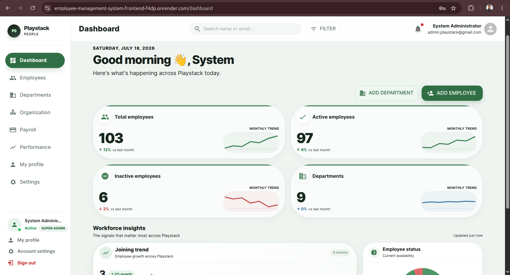 | 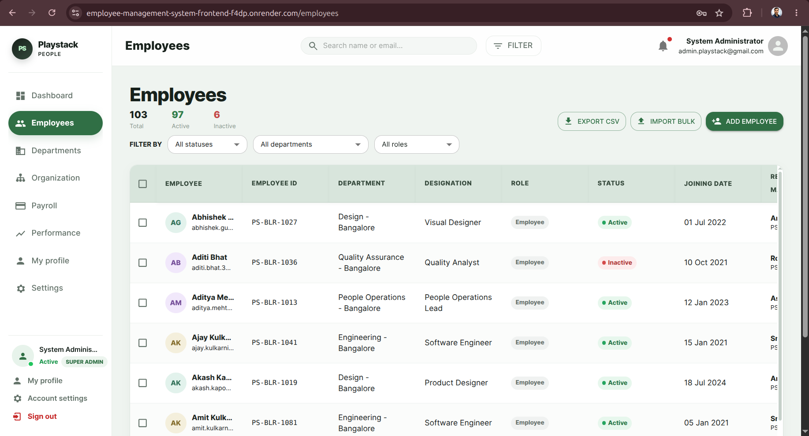 |

| Workforce charts | Global employee search |
| --- | --- |
| 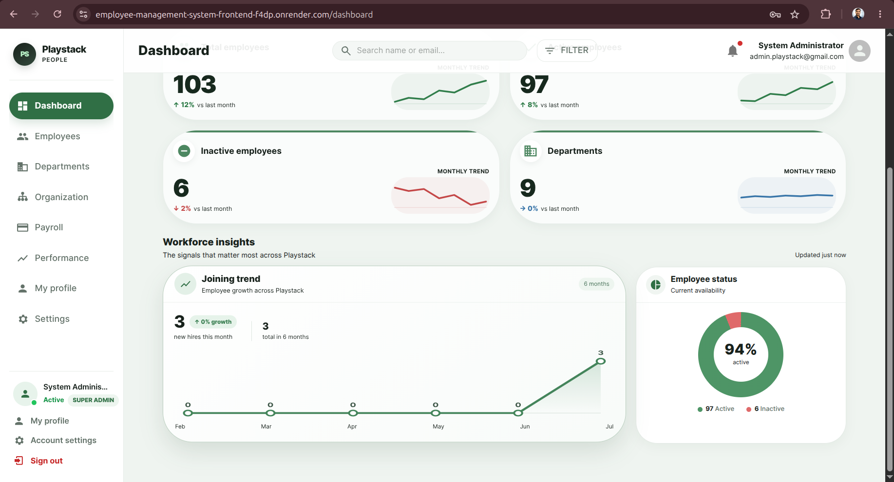 | 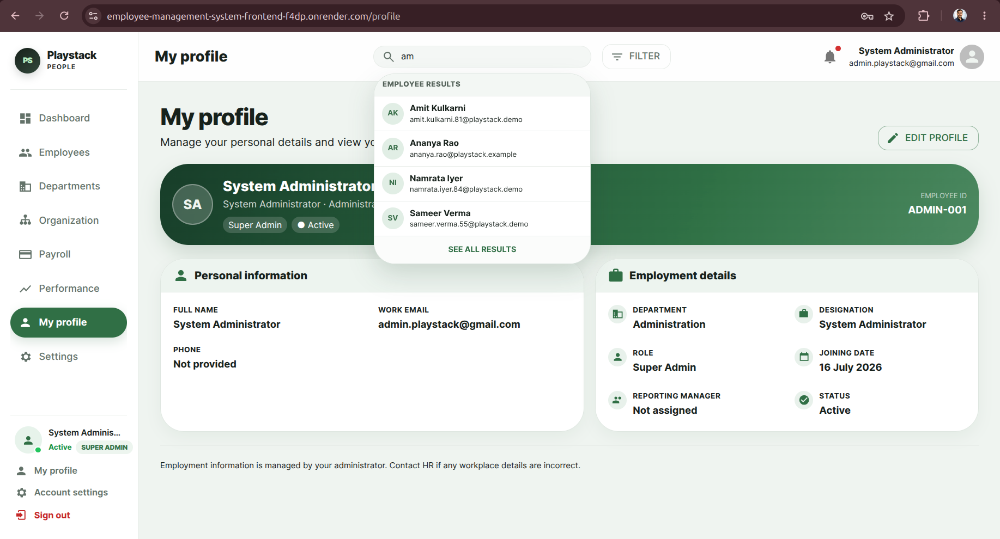 |

### Employee workflows

| Create employee | Employee details |
| --- | --- |
| 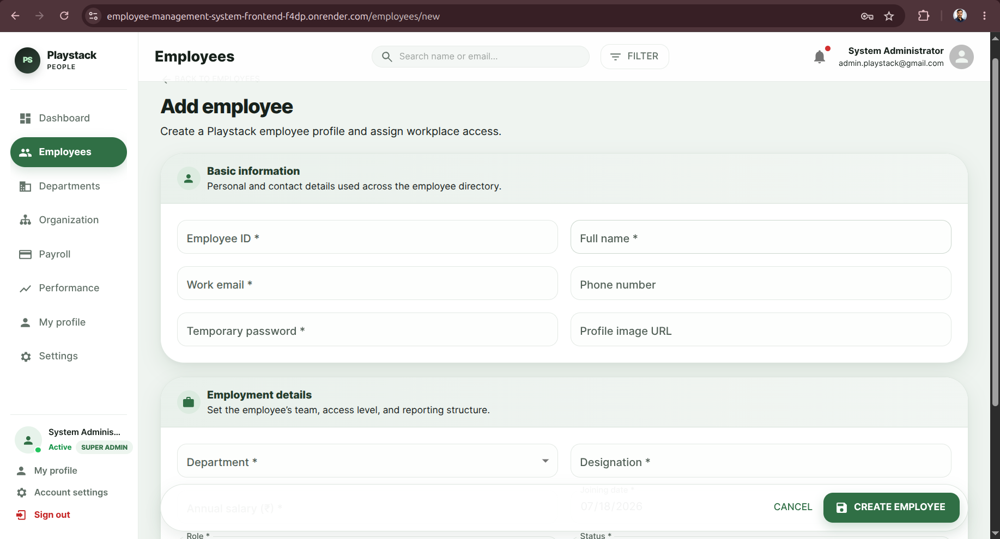 | 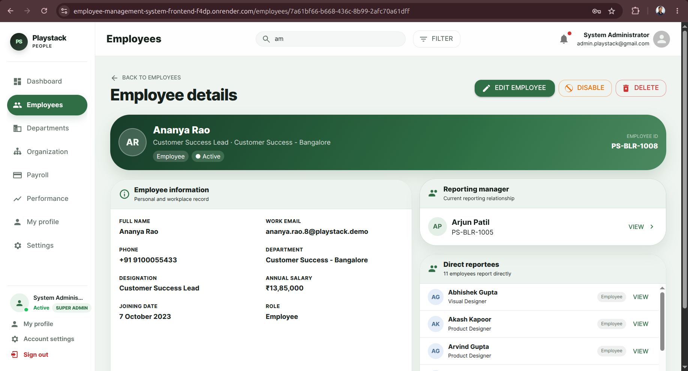 |

| Edit employee | Change reporting manager |
| --- | --- |
| 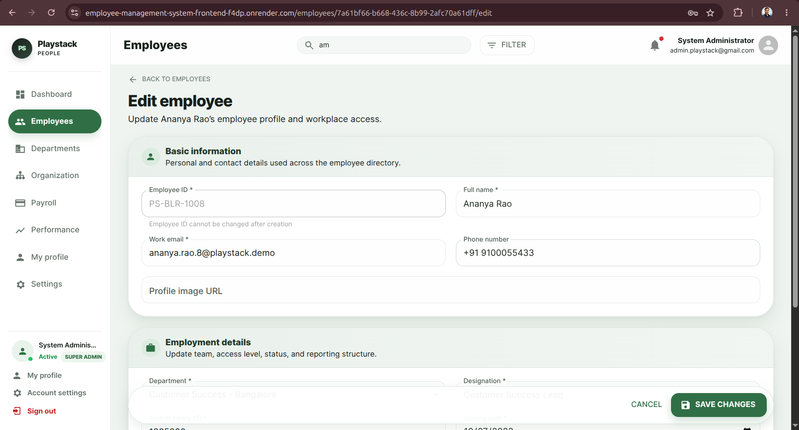 | 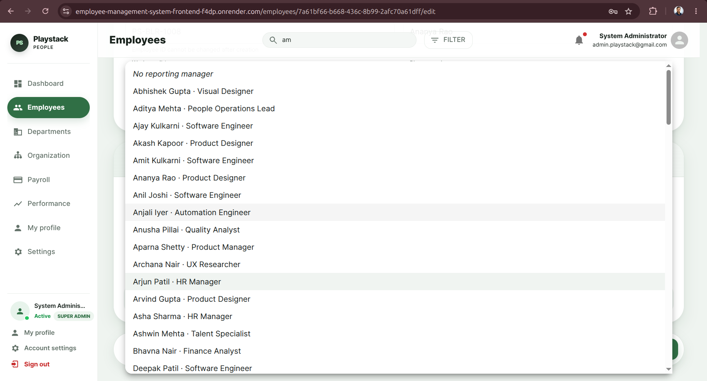 |

### Forgot-password workflow

Employees can submit a recovery notification from the login page. A Super Admin receives the notification, generates a one-time temporary password, and shares it privately with the employee. Only the password hash is stored, while the notification history retains both pending and completed records.

| Submit recovery notification | Confirmation and admin handoff |
| --- | --- |
| 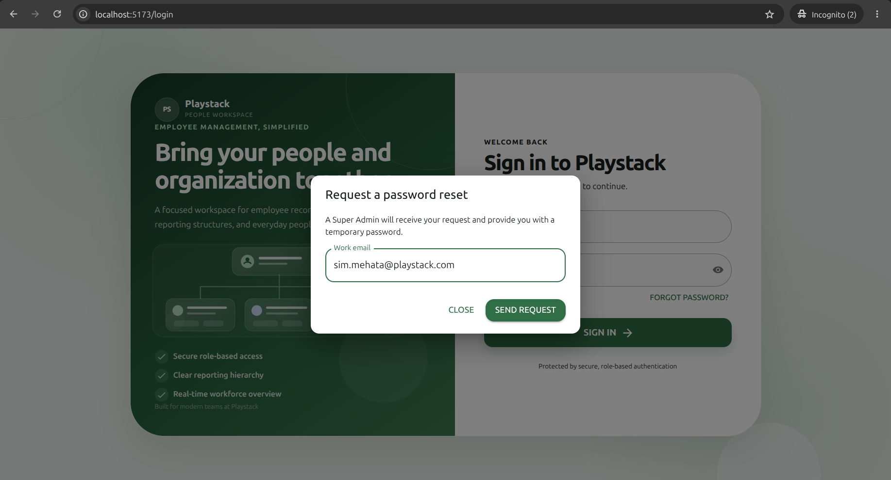 | 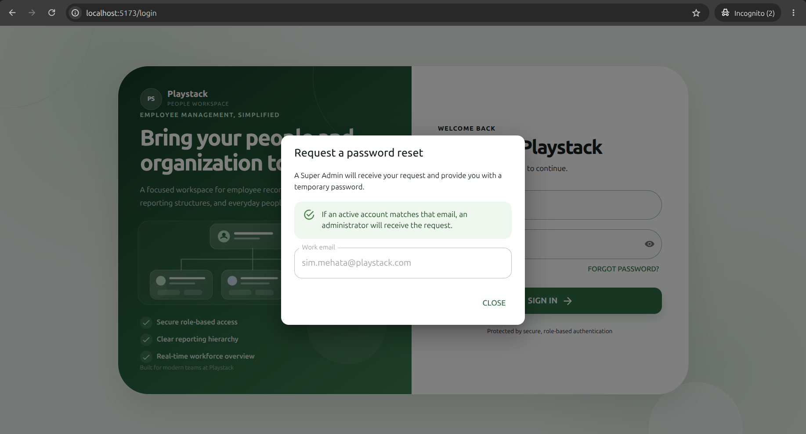 |

### Organization and departments

| Reporting hierarchy | Department directory |
| --- | --- |
| 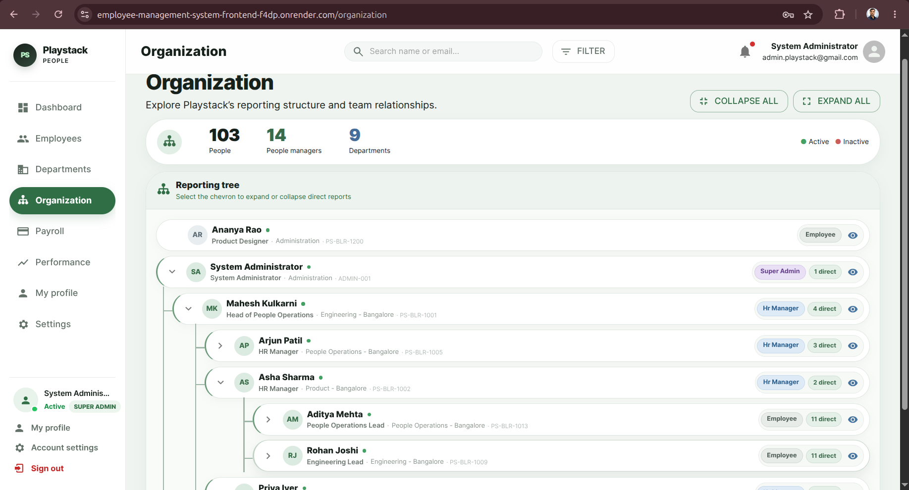 | 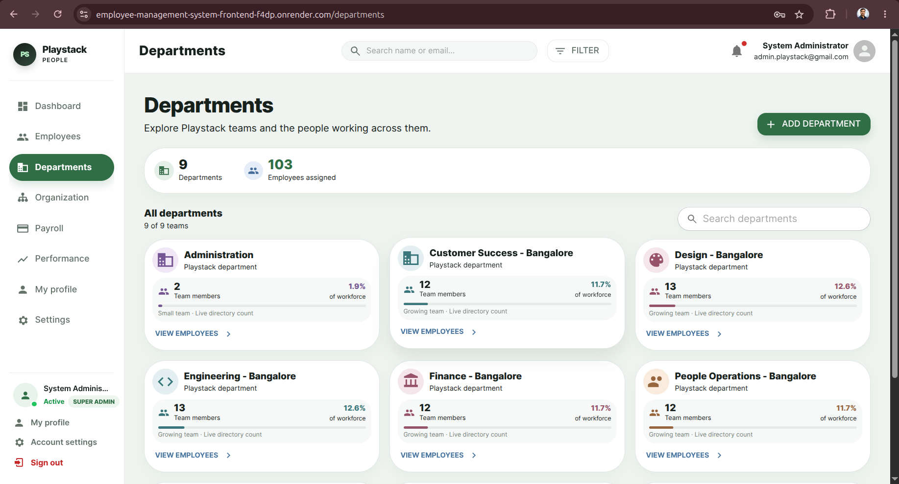 |

<details>
<summary><strong>View more application screenshots</strong></summary>

| Login | CSV import |
| --- | --- |
| 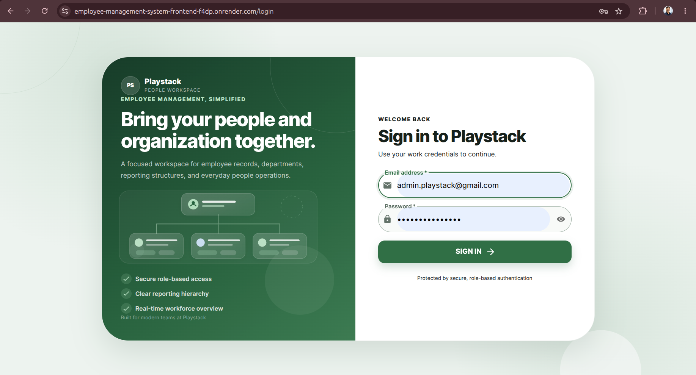 | 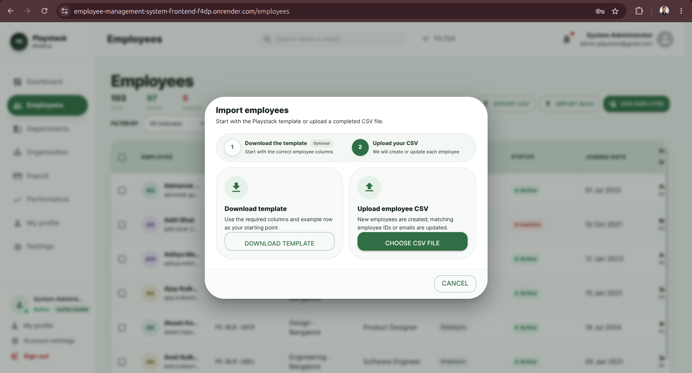 |

| CSV export started | CSV export ready |
| --- | --- |
| 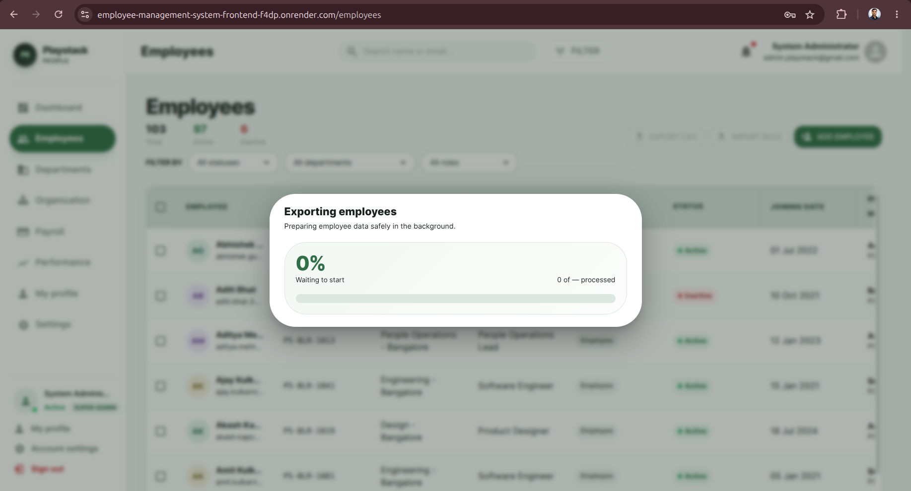 | 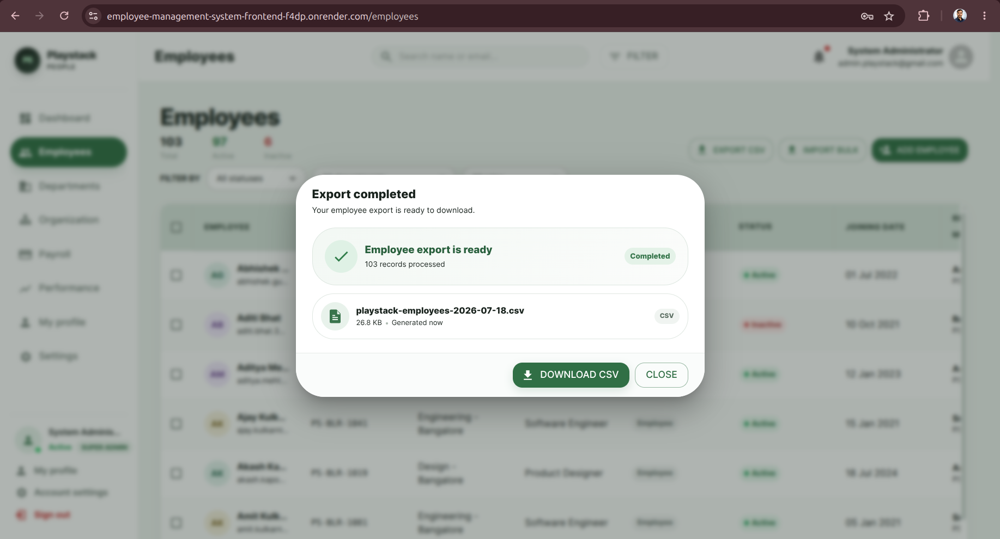 |

</details>

## 🗂️ Project structure

```text
employee-management-system/
├── backend/
│   ├── prisma/              # Schema, migrations, and seed scripts
│   ├── src/modules/         # Feature-based API modules
│   └── tests/               # Unit and API test suites
├── frontend/
│   └── src/                 # Pages, components, auth, and API clients
├── docs/
│   ├── api.md               # API usage and Postman guide
│   └── screenshots/         # Product screenshots
└── README.md
```

## ⚡ Run locally

### Prerequisites

- Node.js 22 or later
- npm
- PostgreSQL or a Neon PostgreSQL project
- Redis is recommended; the API continues without caching when Redis is unavailable

### 1. Install dependencies

```bash
cd backend
npm install

cd ../frontend
npm install
```

### 2. Configure the environment

```bash
cp backend/.env.example backend/.env
cp frontend/.env.example frontend/.env
```

Configure these backend values in `backend/.env`:

```env
DATABASE_URL=
DIRECT_URL=
JWT_SECRET=
JWT_EXPIRES_IN=1h
FRONTEND_URL=http://localhost:5173
REDIS_URL=redis://localhost:6379
SEED_SUPER_ADMIN_EMAIL=
SEED_SUPER_ADMIN_PASSWORD=
SEED_SUPER_ADMIN_NAME=
SEED_SUPER_ADMIN_EMPLOYEE_ID=
```

> Never commit real secrets or local `.env` files.

### 3. Prepare the database

```bash
cd backend
npm run db:validate
npm run db:deploy
npm run db:seed
```

To add realistic demo employees and reporting relationships:

```bash
npm run db:seed:demo
```

### 4. Start both applications

```bash
# Terminal 1
cd backend
npm run dev

# Terminal 2
cd frontend
npm run dev
```

| Service | Local URL |
| --- | --- |
| Frontend | `http://localhost:5173` |
| Backend | `http://localhost:4000` |
| Health check | `http://localhost:4000/api/health` |

## 🔌 API overview

| Module | Endpoints |
| --- | --- |
| Authentication | `POST /api/auth/login`, `POST /api/auth/logout`, `GET /api/auth/me` |
| Dashboard | `GET /api/dashboard/stats`, `GET /api/dashboard/charts` |
| Employees | `GET`, `POST`, `PUT`, and `DELETE /api/employees` |
| Reporting | `GET /api/employees/:id/reportees`, `PATCH /api/employees/:id/manager` |
| Organization | `GET /api/organization/tree` |
| Departments | `GET /api/departments` |
| CSV jobs | Import, export, status, and template endpoints under `/api/employees` |

See the **[complete API documentation](docs/api.md)** for request bodies, responses, authentication instructions, filters, and Postman examples.

## ✅ Testing

The repository currently contains **59 passing backend unit and API tests**, covering authentication, RBAC, employee operations, dashboard data, departments, reporting hierarchy, request logging, and Prisma error handling.

```bash
cd backend
npm test
```

Run database integration tests with a disposable migrated PostgreSQL database:

```bash
TEST_DATABASE_URL=<test-database-url> npm run test:integration
```

Validate production builds:

```bash
cd backend
npm run build

cd ../frontend
npm run lint
npm run build
```

## 🌿 Git workflow

- `main` contains the stable submission-ready application.
- `develop` is used as the integration branch.
- Work is developed through focused `feature/<feature-name>` branches.
- Tested features move through `develop` before being released to `main`.

## 👨‍💻 Author

### Jivan Paratpure

Full Stack Developer focused on building secure, scalable, and user-friendly web applications.

[](mailto:jivanparatpure2002@gmail.com)
[](https://github.com/jivanspjivan)
[](tel:+919325796736)

- **Email:** [jivanparatpure2002@gmail.com](mailto:jivanparatpure2002@gmail.com)
- **Phone:** [+91 93257 96736](tel:+919325796736)
- **GitHub:** [github.com/jivanspjivan](https://github.com/jivanspjivan)

---

<div align="center">

Built with care by **Jivan Paratpure**

If you find this project useful, consider giving the repository a ⭐

</div>
